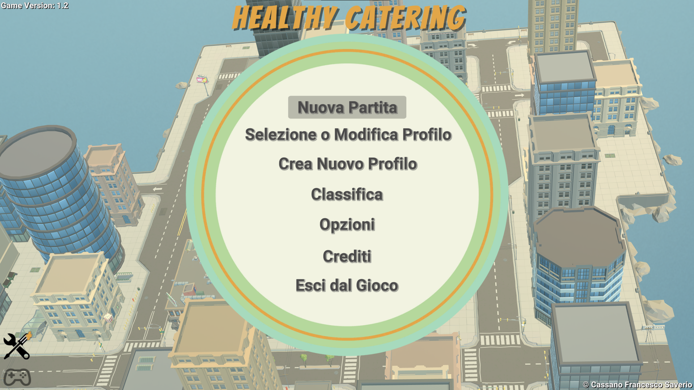
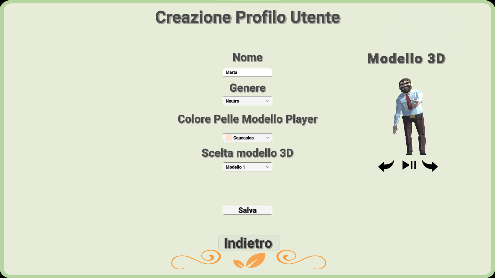
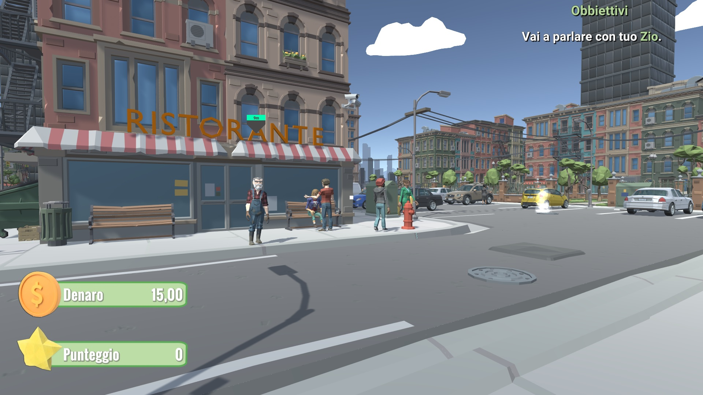
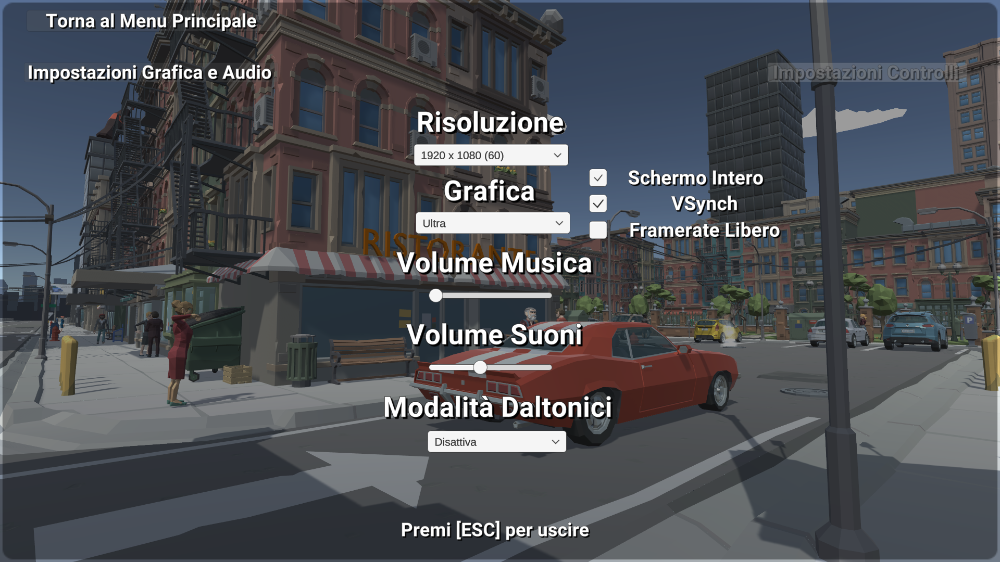

# Healthy Catering [![CC BY-NC-SA 4.0][cc-by-nc-sa-shield]][cc-by-nc-sa] [![CC BY-NC-SA 4.0][cc-by-nc-sa-image]][cc-by-nc-sa]

[cc-by-nc-sa]: http://creativecommons.org/licenses/by-nc-sa/4.0/deed.it
[cc-by-nc-sa-image]: https://licensebuttons.net/l/by-nc-sa/4.0/88x31.png
[cc-by-nc-sa-shield]: https://img.shields.io/badge/License-CC%20BY--NC--SA%204.0-lightgrey.svg

  

Lo scopo del videogioco è di consolidare le conoscenze di coloro che hanno intrapreso uno studio presso un istituto Alberghiero o un corso concernente le Scienze della Nutrizione e/o corsi simili mirati alla sensibilizzazione sul tema della corretta alimentazione per lo più indirizzata a individui caratterizzati da un certo quadro patologico, con annesso accenno all’argomento ‘’sostenibilità ambientale’’. In più il gioco permetterà al giocatore di imparare a gestire al meglio il proprio denaro, come aspetto secondario del gioco.

## Caratteristiche Gioco

- Gioco in prima persona.
- Gestionale ristorante.
- Sistema di classificazione dei piatti in base agli ingredienti ed alle loro caratteristiche.
  - Piatti classificati per nutriScore ed ecoScore.
- Grafica polygon.
- Open Map.
- 3 livelli di gioco.
  - Livello 0: Tutorial di gioco.
  - Livello 1: Patologia reflusso.
  - Livello 2: Patologia diabete.

## Requisiti di Sistema

I requisiti Hardware e Software del gioco:

### Requisiti minimi

-	Processore: architettura X64 con SSE2, Apple Silicon
-	RAM: 512MB per l’esecuzione
-	Hard Disk: 1GB
-	Scheda video: Scheda grafica integrata nel processore
-	Risoluzione: 320x240 o superiori - Aspect Ratio: 4:3 e/o 16:9

### Requisiti consigliati

-	Processore: i3-540 o superiori
-	RAM: 1GB per l’esecuzione
-	Hard Disk: 1GB
-	Scheda Video: GEFORCE GT710
-	Risoluzione: 1920x1080 o superiori - Aspect Ratio: 16:9

### NOTA BENE!
L'aspect ratio 4:3 non è pienamento supportato, l'esperienza potrebbe variare rispetto alla modalità 16:9 pienamente supportata.

### Requisiti Software

- Windows 10/11
- High Sierra 10.13+

## Aiutanti

### Colonna Sonora
La colonna sonora è sta realizzata da [@AleCongi](https://github.com/AleCongi), profilo [Spotify](https://open.spotify.com/artist/4iiwwWtSPD6yEIKclYS0s6). 

### Design Artist

Le grafiche utilizzate nel gioco sono state realizzate da <a href="https://linktr.ee/franci.cara">Franci.cara</a>.

### 3D Artist

Il modello 3D interno del ristorante è stato realizzato da Angelica.

## Immagini di gioco

---
Questa opera è sotto 
[Licenza Creative Commons Attribuzione - Non commerciale - Condividi allo stesso modo 4.0 Internazionale][cc-by-nc-sa].
 
Cassano Francesco Saverio 
Carella Alessandro
