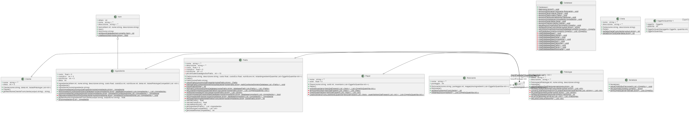

Meccaniche di gioco base:

Gestione inventario negozio 
Gestione punteggio player. 
Gestione richieste cliente. 
Gestione elaborazione piatto del cliente. 
Gestione consegna piatto cliente. 
Gestione economia 

Meccaniche di gioco avanzate:

Inventario player 
compra/vendita 
Competizione ristoranti 
